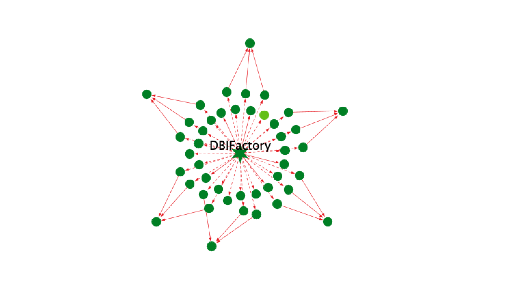

# Dropwizard

*Dropwizard is a sneaky way of making fast Java web applications.*

## Dropwizard README

Please see [Dropwizard README](README-Dropwizard.md) in the root directory of the project.

CodeMR Report
=================

You can download or clone the project to use the existing extracted model and graphs. 
You can create your graphs, your working sets and analyse the project based on the extracted model without limitation. 
You can download CodeMR plugins for your favorite IDE from:
- [CodeMR for IntelliJ](https://plugins.jetbrains.com/plugin/10811-codemr)
- [CodeMR for Eclipse](https://marketplace.eclipse.org/content/codemr-software-quality-tool) 

See CodeMR [web site](https://www.codemr.co.uk) for details on the CodeMR.

Download [trial license](https://www.codemr.co.uk/downloads) to try CodeMR for other projects.

CodeMR model path: ./codemr/dropwizard/dropwizard.mdl

### Snapshots ###

#### Model Views #### 
- Overview 1

- Overview 2

- TreeMap View (Colors by Complexity)

- Package Structure View (Colors by Cohesion)

-Package Dependency View 

- Outline View 

#### Project Graphs #### 
- Critial Classes and Outbound Relations
 

- Critial Classes and Inbound Relations
 

- Project Modul Graph

- Dropwizard Core relations 

- Dropwizard Migrationg relations 

- Dropwizard Database module relations (db, hibernate, jdbi, jbi3)

- DBIFactory relations 

- All Inheritance (Radial Tree Layout)

